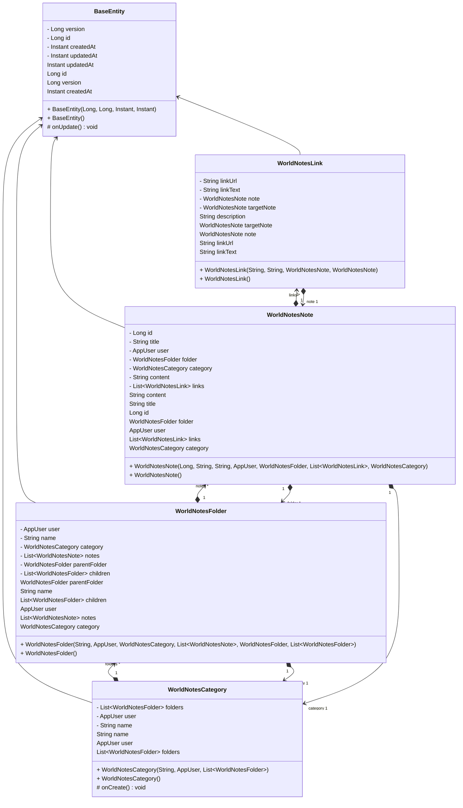
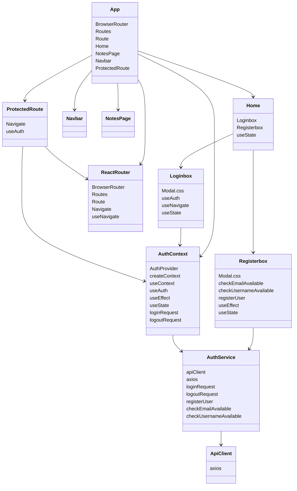

# NotesHandler

**Projektdokumentation – Modul 223**

**Autor:** Roberto Marchese
**Datum:** 12.12.2025
**Version:** 1.0

---

## Einleitung

NotesHandler ist eine webbasierte Notizverwaltung, die es Benutzer:innen ermöglicht, strukturierte Notizen in Ordnern zu organisieren und Inhalte mithilfe von Markdown zu verfassen.
Das Projekt wurde im Rahmen des Moduls 223 entwickelt und legt den Fokus auf eine saubere Backend-Architektur, sichere Authentifizierung sowie eine klare Trennung zwischen Frontend und Backend.

---

## Projektidee

Ziel des Projekts ist die Entwicklung einer persönlichen, mehrbenutzerfähigen Notiz-Applikation mit folgenden Kernfunktionen:

* Benutzer-Authentifizierung (Login / Registrierung)
* Verwaltung von Notizen und Ordnern
* Markdown-Unterstützung für strukturierte Inhalte
* Klare REST-API zur Anbindung eines React-Frontends
* Erweiterbarkeit (z. B. Wiki-Links, Kategorien, Versionierung)(Aus Zeitgründen nicht abschliessend umgesetzt)


## Versionsverlauf (Zusammenfassung der Commits)

Die Entwicklung von NotesHandler erfolgte iterativ über mehrere klar abgegrenzte Entwicklungsphasen.
Dabei wurden Backend, Frontend, Infrastruktur und Dokumentation schrittweise aufgebaut und erweitert.

### Phase 1 – Projektinitialisierung & Infrastruktur

- Initiales Projekt-Setup und Repository-Erstellung

- Vorbereitung von application.properties

- Initialisierung der Docker-Umgebung (PostgreSQL, Backend, Frontend)

- Einrichtung von Docker Compose inklusive Umgebungsvariablen

- Erste lauffähige Backend- und Datenbankanbindung

### Phase 2 – Authentifizierung & Benutzerverwaltung

- Implementierung der Benutzer-Entitäten

- JWT-basierte Authentifizierung im Backend

- Login- und Registrierungsfunktionalität im Backend

- Frontend-Login- und Registrierungsformular

- Validierung von Benutzername und E-Mail-Adresse

- Vollständige Login-/Register-Funktionalität Frontend ↔ Backend

### Phase 3 – Notizen-Domäne (Backend)

- Modellierung der Notizen-, Ordner- und Kategorie-Tabellen

- Einführung von DTOs, Mappers, Repositories, Services und Controllern

- Korrekturen an Kategorien- und Ordner-Logik

- Zugriffsschutz über JWT (kein manuelles userId-Handling in Controllern)

- Stabilisierung der Ordner- und Notizen-Endpunkte

### Phase 4 – Frontend-Notizen & UI-Funktionen

- Darstellung von Ordner- und Notizenstrukturen im Frontend

- FolderTree mit verschachtelten Ordnern und Notizen

- Kontextmenü für Ordner und Notizen (Erstellen, Löschen, Umbenennen, Verschieben)

- Synchronisation zwischen Frontend und Backend

- CORS-Handling für Docker-Setup

### Phase 5 – Editor & Erweiterungen

- Integration eines Markdown-Editors im Frontend

- Vorbereitung des Backends für Wiki-Link-Funktionalität

- Einführung eines Read-/Edit-Modus für Notizen

- Korrekturen an der Notiz-Erstellung

### Phase 6 – Tests & Dokumentation

- Ergänzung einfacher automatisierter Tests

- Laufende Aktualisierung und Konsolidierung der README

- Ergänzung der Frontend-Architektur-Dokumentation

- Dokumentation der JWT-Authentifizierung (Frontend & Backend)

- Integration eines Klassen-/Entity-Diagramms

- Korrekturen und Präzisierungen in der Testdokumentation

### Phase 7 – Versionspflege & Merges

- Regelmässige Merges aus dem main-Branch

- Bereinigung von Tippfehlern

- Konsolidierung der Dokumentation

- Feinschliff kurz vor Abgabe


---

## Anforderungsanalyse

### Kernanforderungen

**Backend**

* Benutzerverwaltung mit JWT-basierter Authentifizierung
* CRUD-Funktionalität für Notizen
* Ordnerstruktur (hierarchisch)
* Zugriffsschutz pro Benutzer:in
* REST-konforme Endpunkte

**Frontend**

* Übersichtliche Darstellung von Ordnern und Notizen
* Editor mit Markdown-Vorschau
* Read-/Edit-Modus für Notizen
* Kommunikation ausschliesslich über REST-API

---

## User Stories

* **User Story 1:**
  Als Benutzer:in möchte ich mich registrieren und einloggen, damit meine Notizen geschützt sind.

* **User Story 2:**
  Als Benutzer:in möchte ich Notizen erstellen, bearbeiten, löschen und Ordnern zuweisen können.

* **User Story 3:**
  Als Benutzer:in möchte ich Markdown verwenden, um strukturierte und lesbare Inhalte zu erstellen.


Die Vollständigen User Stories inklusive Akzeptanzkriterien sind im GitHub-Wiki des Projekts dokumentiert.

https://github.com/ElodinderBarde/NotesHandler/wiki

---

## Backend-Architektur

### Layered Architecture

Das Backend folgt einer klassischen **Layered Architecture**, um Verantwortlichkeiten klar zu trennen und Wartbarkeit zu gewährleisten.

**Schichten:**

* **Controller Layer**
  Verarbeitet HTTP-Requests und stellt REST-Endpunkte bereit.

* **Service Layer**
  Enthält die Business-Logik (z. B. Zugriffskontrolle, Validierung, Notizenverwaltung).

* **Repository Layer**
  Kapselt den Datenbankzugriff über Spring Data JPA.

Das React-Frontend kommuniziert ausschliesslich über die REST-API mit dem Backend.


---

## Datenbankmodell (ER-Diagramm)

Die Datenbank basiert auf einer relationalen Struktur in PostgreSQL.

Zentrale Entitäten:

* `app_users`
* `worldnotes_note`
* `worldnotes_folder`
* `worldnotes_note_link` (optional)
* `worldnotes_category` (optional)

Jede Notiz gehört genau einem Benutzer.
Ordner können hierarchisch aufgebaut sein.
Fremdschlüssel stellen die referenzielle Integrität sicher.



---

## Authentifizierung (JWT)

Die Authentifizierung erfolgt über **JSON Web Tokens (JWT)**:

1. Login mit Benutzername & Passwort
2. Backend generiert JWT
3. Token wird im `Authorization`-Header (`Bearer <token>`) mitgesendet
4. Token wird serverseitig validiert
5. Zugriff erfolgt kontextabhängig auf den eingeloggten Benutzer


### Athentifizierungs-Architektur



---

## Technologie-Stack (Backend)

| Technologie                 | Version | Verwendung              |
| --------------------------- | ------- | ----------------------- |
| Java                        | 21      | Programmiersprache      |
| Spring Boot                 | 3.3.7   | Backend-Framework       |
| Spring Web                  | 3.3.7   | REST-API                |
| Spring Security             | 6.x     | Authentifizierung       |
| JWT (JJWT)                  | 0.11.5  | Token-basierte Security |
| BCrypt                      | –       | Passwort-Hashing        |
| Spring Data JPA / Hibernate | 6.x     | ORM                     |
| PostgreSQL                  | 16      | Produktivdatenbank      |
| H2                          | –       | Testdatenbank           |
| Maven                       | 3.x     | Build-Tool              |
| Springdoc OpenAPI           | 2.3.0   | API-Dokumentation       |
| Spring Boot Test            | 3.3.7   | Tests                   |
| Spring Security Test        | 6.x     | Security-Tests          |

---

## Frontend

Das Frontend wird mit **React** umgesetzt und kommuniziert ausschliesslich über die REST-API mit dem Backend.


## Frontend-Architektur

Das Frontend basiert auf einer komponentenbasierten Architektur mit React.
Die Anwendung ist klar in wiederverwendbare UI-Komponenten und logische Seiten aufgeteilt.

### Zentrale Konzepte

* **Komponentenbasierter Aufbau**
  Jede Funktion (z. B. Sidebar, NoteEditor, LoginModal) ist als eigenständige React-Komponente umgesetzt.

* **State Management**
  Lokaler State wird mit React Hooks (`useState`, `useEffect`) verwaltet.
  Authentifizierungsinformationen werden über einen zentralen `AuthContext` bereitgestellt.

* **Routing**
  Die Navigation erfolgt über `react-router-dom`.
  Geschützte Routen (z. B. `/notes`) sind nur für eingeloggte Benutzer:innen zugänglich.

* **API-Kommunikation**
  Die Kommunikation mit dem Backend erfolgt über Axios.
  Der JWT-Token wird automatisch im Authorization-Header mitgesendet.

Diese Architektur ermöglicht eine klare Trennung von Logik, Darstellung und Datenzugriff.

### JWT im Frontend

Nach erfolgreichem Login speichert das Frontend den JWT-Token im Speicher (Context).
Bei jedem geschützten API-Request wird der Token automatisch im HTTP-Header übermittelt.

Nicht authentifizierte Benutzer:innen werden beim Zugriff auf geschützte Routen automatisch auf die Login-Seite umgeleitet.


### Aktuelle Funktionen

* Ordner- und Notizenübersicht
* Drag-and-Drop für Ordner/Notizen
* Context-Menü auf Ordnern/Notizen
* Markdown-Editor mit Preview
* Read-Only-Modus (Standard)
* Edit-Modus per Button
* Speicherung über REST


---

## Sicherheitskonzept

* Passwort-Hashing mit BCrypt
* JWT-basierte Authentifizierung
* Zugriff auf Notizen ausschliesslich benutzergebunden, mit serverseitiger Validierung
* Keine sensiblen Daten im Klartext gespeichert

Zusätzlich werden sensible Daten wie JWT-Secrets und Datenbank-Zugangsdaten
nicht im Code, sondern über Umgebungsvariablen konfiguriert.


---

## Testplan

**Backend**

* Unit-Tests für Services
* Security-Tests für geschützte Endpunkte

**Frontend**

* Manuelle Tests der Kernfunktionen (Login, Navigation, Notizen bearbeiten)
* Verifikation des Routing-Verhaltens bei eingeloggten / nicht eingeloggten Benutzern
* Überprüfung der Markdown-Darstellung und des Read/Edit-Modus

Die Tests sind im jeweiligen Quellcode-Verzeichnis dokumentiert und nachvollziehbar implementiert.

---

## Installationsanleitung

Folgend ist eine Schritt-für-Schritt-Anleitung zur manuellen Installation und zum Starten der Anwendung.
Das Docker Compose Setup erlaubt jedoch eine inbetriebnahme mit IntelliJ durch starten des Debuggers, der die Backend- und Frontend-Module nacheinander startet, sowie die Datenbank mit 
Docker Compose hochfährt und mit Initialdaten befüllt.

Die Passwörter für die initialen Benutzer sind in den .env-Dateien im Backend-Docker-Ordner hinterlegt.
Fügen Sie diese bitte entsprechend Ihrer lokalen Umgebung in die IntelliJ Run/Debug Konfigurationen ein.

Darunter: 
- Passwort für den Datenbankbenutzer
- Benutzername
- JWT Secret Key für die Token-Generierung


Abhängig ob Sie mit ```npm run dev``` oder mit dem Backend-Container arbeiten möchten, erreichen Sie das Frontend unter:

- http://localhost:5173 (npm run dev)
- http://localhost:8084 (Frontend-Container)


### Voraussetzungen

**Backend**

* Java JDK 21
* Maven
* Docker & Docker Compose
* Git

**Frontend**

* Node.js (LTS)
* npm

**Empfohlene IDEs**

* Backend: IntelliJ IDEA
* Frontend: Visual Studio Code

---

### Projekt klonen

```bash
git clone https://github.com/ElodinderBarde/NotesHandler
cd NotesHandler
```

---

### Backend – Datenbank starten

```bash
cd backend/docker
docker-compose up -d
```

**Datenbank**

* Host: localhost
* Port: 5432
* Datenbank: noteshandler
* Benutzer / Passwort: siehe `docker-compose.yml`

---

### Backend starten

```bash
mvn spring-boot:run
```

Backend erreichbar unter:
 `http://localhost:8080`

---

## Dokumentation

* **Swagger / OpenAPI:** `http://localhost:8080/swagger-ui.html`

## Versionskontrolle (Git)

Für die Entwicklung wurde Git konsequent eingesetzt.

* Verwendung eines zentralen GitHub-Repositories
* Trennung von Entwicklungsständen durch Branches
* Regelmässige, thematisch saubere Commits
* Aussagekräftige Commit-Messages
* Merge von Feature-Branches in den `main`-Branch

Dies ermöglichte eine nachvollziehbare Entwicklung und eine saubere Versionshistorie.

---

## Hilfsmittel

### ChatGPT

Wurde punktuell zur Unterstützung eingesetzt, insbesondere für:

* Architektur-Reviews
* Fehleranalyse
* Refactoring-Hinweise
* Dokumentationsstruktur

### SideQuests Modul 223

* Strukturvorgaben
* Architekturbeispiele
* Technische Orientierung

---

## Anmerkungen

* Erweiterungen wie Wiki-Links oder Versionierung sind konzeptionell vorbereitet.

---

